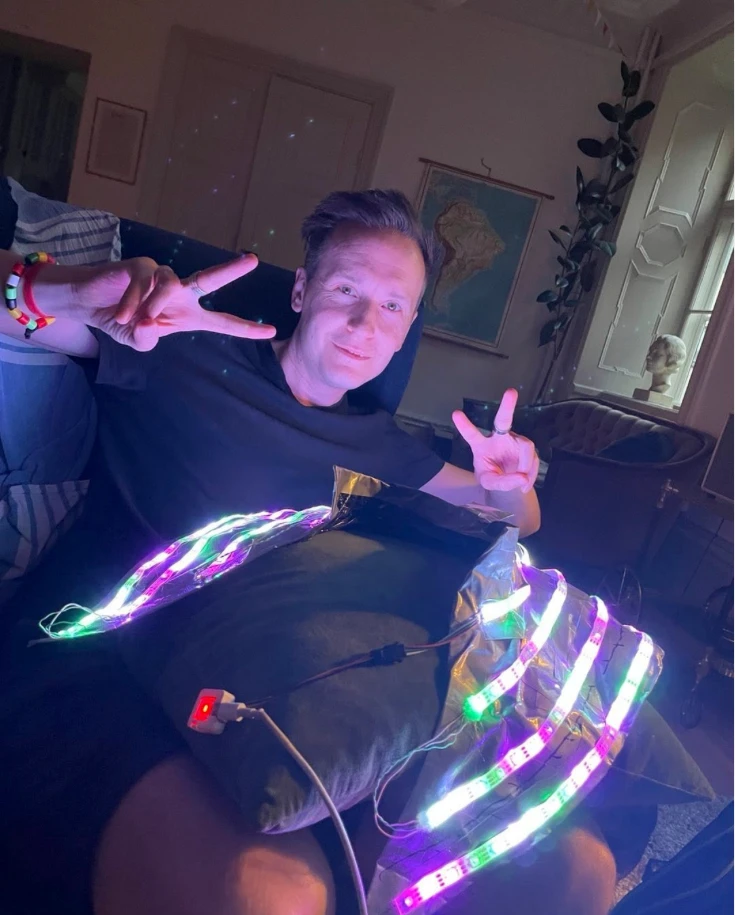
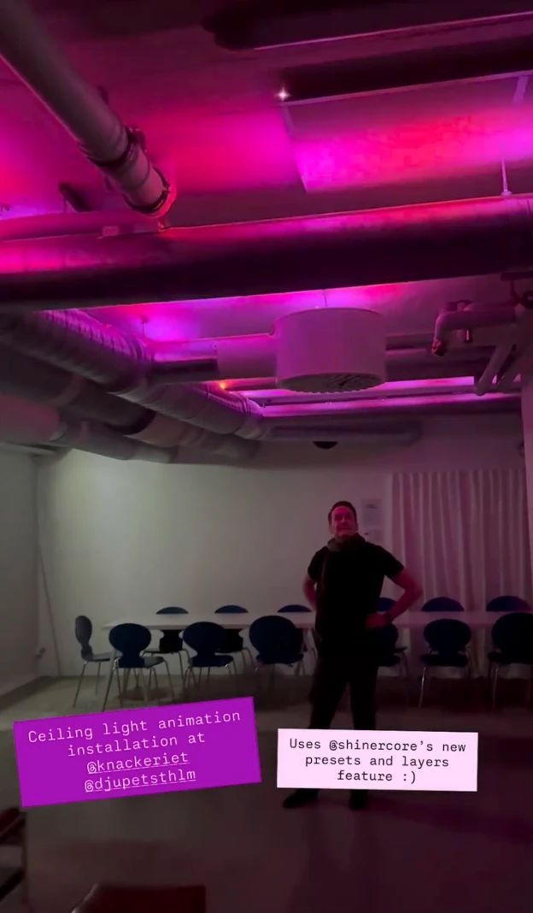

# Shinercore

ShinerCore is an open source firmware/Arduino sketch for ESP32 controllers
to make pretty animations on addressable RGB LED strips (such as NeoPixel strips).
It's hard-coded to work well with M5Stack's M5AtomS3 modules, which are very small
and cheap and work really great for the use case, but it shouldn't be too much of
a pain to port it to another ESP32 platform.

Everything is configured live over Bluetooth from
[a companion app](https://github.com/nevyn/ShinerCoreRemote)
([App Store](https://apps.apple.com/app/id6451475618)) — colors, animation, speed,
brightness, and the layers and blend modes they're composited with — so you tune the
lights while you're wearing them, without reflashing. A stack of layers is a preset,
and the button on the device steps through the presets.

Give a core a microphone and it finds the beat of nearby music, running animations in
beats per cycle instead of seconds per cycle. Cores within earshot of each other share
a single beat grid over ESP-NOW — whoever hears the music most confidently leads — and
walk through their presets together, so a whole camp pulses in time. Pulsing in each
*others'* colors is still to come.

  

More of what people build with it: [@shiner.core](https://www.instagram.com/shiner.core/).

## Setup

Since it only runs on the M5Atom and M5AtomS3, you'll need to get one of those
and [configure Arduino IDE for it](https://docs.m5stack.com/en/arduino/arduino_development).

For an M5Atom Echo, build with the Echo define so the microphone (beat
detection) defaults on — no core defines it, so pass it yourself:

```
arduino-cli compile -b m5stack:esp32:m5stack_atom --build-property "compiler.cpp.extra_flags=-DARDUINO_M5STACK_ATOM_ECHO"
```

On any other build, beat detection can still be enabled at runtime with the
`mic` setting if the Atom is wired with an SPM1423 like an Echo.

Install the following libraries from
 the Arduino library manager:
* M5Unified
* FastLED
* ArduinoBLE
* [OverAnimate](https://github.com/nevyn/OverAnimate) isn't available from the library manager, so you'll need to manually clone it to your Arduino libraries folder

## todo

- [x] hear every other shinercore in range (ESP-NOW broadcast; BLE couldn't mesh)
- [ ] incorporate every other shinercore's primary color in the main animation
- [x] sync the beat grid between shinercores; the most confident mic leads
- [x] beat detection from the microphone (M5Atom Echo)


## LED Strip Ordering Guide

The firmware uses the WS2811 protocol via FastLED, which is compatible with
several chip families:

| Chip | Notes |
|------|-------|
| **WS2812B** | Most common "NeoPixel" chip. Built into each LED. 5V. This is the default choice for strips. |
| **WS2811** | External driver IC (one chip drives 3 LEDs). Typically 12V. Same protocol as WS2812B. |
| **SK6812** | WS2812B-compatible clone. Also available in RGBW (4-channel with dedicated white). |

**Key specs when ordering:**

| Spec | Typical choices |
|------|-----------------|
| Density | 30/m, **60/m**, or 144/m |
| Voltage | **5V (WS2812B)** or 12V (WS2811) |
| Color | **RGB (3-channel)** or RGBW (4-channel, SK6812) |
| IP rating | IP30 (bare), **IP65 (silicone coated)**, IP67 (silicone tube) |

Recommended configuration bolded.

**Where to buy:** Good sources are Adafruit (search "NeoPixel strip"), 
BTF-Lighting (Amazon), or AliExpress for bulk reels. DigiKey has limited strip selection.

**Power note:** At 5V, long runs need power injection every ~3m at 60 LEDs/m
to avoid voltage drop and color shift. The `maxCurrent` setting (mA, 0 = off)
caps the frame's total draw across both outputs by dimming, protecting the
battery from brownout on bright frames; set it to what your pack can deliver.

## Resources
* [What ShinerCore is for](https://nevyn.dev/wiki/portfolio/shinercore/), in prose
* [Bluetooth assigned numbers](https://btprodspecificationrefs.blob.core.windows.net/assigned-numbers/Assigned%20Number%20Types/Assigned_Numbers.pdf)
